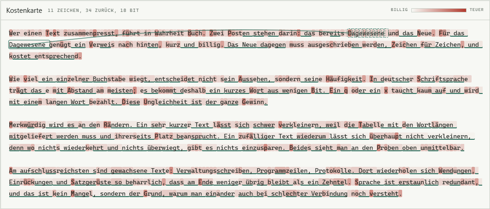

# Redundanz

Kompression von Grund auf — LZ77 und Huffman, echter Bitstrom, geprüfter Rückweg —
und dazu die Frage, die man dabei sonst nie zu sehen bekommt: **wo genau in einem Text
sitzt eigentlich die Wiederholung?**

Jedes Zeichen ist danach eingefärbt, was es wirklich an Bits kostet. Blasse Stellen sind
fast umsonst, kräftige teuer. Wer über eine unterstrichene Stelle fährt, sieht als Bogen,
woher sie kopiert wurde.

### → [Öffnen](https://ssims437.github.io/redundanz/)

Eine einzelne HTML-Datei. Kein Build, kein Paketmanager, keine externe Zeile Code.
Alles bleibt im Browser; eigener Text wird nirgendwohin geschickt.

---

## Warum das mehr ist als ein Tutorial

Wie Deflate funktioniert, steht überall. Interessanter ist, was man sieht, wenn man es
über einen echten Text laufen lässt:

- In **Quelltext** ist die erste Kopie einer Funktion kräftig rot, jede weitere blass —
  ein Rückverweis kostet knapp 20 Bit, egal ob er 11 oder 200 Zeichen ersetzt.
- In **deutscher Prosa** sind Wortanfänge teuer und Endungen fast gratis. `-ung`, `-lich`,
  `der `, `ein` stehen schon irgendwo weiter oben.
- Bei **Zufallszeichen** passiert gar nichts: 0,3 % aus Rückverweisen, 6,7 Bit je Zeichen,
  84 % der Ursprungsgröße. Wo nichts wiederkehrt, ist nichts einzusparen.

## Was geprüft wird

Bei jedem Durchgang laufen zwei Kontrollen, ohne die jede Zahl hier wertlos wäre:

1. **Rückweg.** Das Gepackte wird wieder entpackt und Byte für Byte mit dem Original
   verglichen. Steht als „identisch“ oder „ABWEICHUNG“ in den Kennzahlen.
2. **Größenvergleich.** Gegen das im Browser eingebaute
   `CompressionStream('deflate-raw')`.

Gemessen gegen `zlib.deflateRawSync(level 9)`:

| Probe | Original | dieser Code | zlib | |
|---|---|---|---|---|
| deutsche Prosa | 1 686 | 207 | 201 | 1,03× |
| Quelltext | 1 932 | 135 | 131 | 1,03× |
| stark wiederholt | 3 600 | 26 | 23 | 1,13× |
| kleiner Wortschatz | 3 000 | **124** | 125 | 0,99× |
| Zufallsbytes | 3 000 | **1 049** | 1 049 | 1,00× |

Ein bis drei Prozent neben einer über Jahrzehnte optimierten Bibliothek, bei zwei Proben
gleichauf oder darunter. 285 kB brauchen rund 10 ms.

## Der Kopf war die ganze Geschichte

Die erste Fassung lag 1,6× bis 7,4× über zlib. Die Ursache stand nicht im Algorithmus,
sondern im Kopf: 286 + 30 Codelängen zu je 4 Bit sind **162 Byte Fixkosten**, unabhängig
von der Eingabe.

Nachgemessen, aufgeteilt nach Kopf und Daten:

| Probe | mein Kopf | meine Daten | zlib gesamt |
|---|---|---|---|
| deutsche Prosa | 162 | 161 | 201 |
| stark wiederholt | 162 | **7** | 23 |
| Zufallsbytes | 162 | 981 | 1 049 |

Meine *Daten* waren in allen Fällen kleiner als zlibs *Gesamtgröße*. Der Rückstand war
vollständig der naive Kopf. Deflate codiert die Tabelle deshalb ihrerseits — mit einem
dritten Huffman-Baum über 19 Symbole, davor eine Lauflängencodierung für die vielen
Nullen. Damit fällt der Kopf auf 20 bis 70 Byte, und der Rückstand verschwindet.

Das ist die Art Befund, die man nur bekommt, wenn man die Zahl aufteilt statt sie
insgesamt anzustarren.

## Aufbau

| Teil | Was es tut |
|---|---|
| `lz77` | Hash-Ketten über 3-Byte-Präfixe, Kette bis 128 Kandidaten, Lazy Matching |
| `codeLengths` | Huffman-Codelängen; zu tiefe Bäume durch Stauchen der Häufigkeiten auf 15 Bit begrenzt |
| `canonical` | kanonische Codes aus den Längen |
| `rleLengths` | Lauflängencodierung der Codetabelle (Symbole 16/17/18 wie in Deflate) |
| `encode` / `decode` | Bitstrom mit Extrabits für Länge und Distanz, vollständig symmetrisch |

Fenster 32 768, kürzeste Übereinstimmung 3, längste 258 — dieselben Grenzen wie Deflate,
damit der Vergleich fair bleibt.

## Was fehlt

- **Kein statischer Huffman-Block und keine gespeicherten Blöcke.** Deflate wählt pro
  Block zwischen drei Verfahren; hier gibt es immer nur den dynamischen Baum. Bei sehr
  kurzen oder unkomprimierbaren Eingaben verliert das ein paar Byte.
- **Nur ein Block für die ganze Eingabe.** Echtes Deflate teilt lange Eingaben auf und
  baut je Abschnitt neue Bäume, was sich bei wechselndem Inhalt lohnt.
- **Kein optimales Parsing.** Lazy Matching schaut ein Zeichen voraus, mehr nicht.

Alle drei erklären den verbliebenen Abstand von ein bis drei Prozent.

## Lizenz

[MIT](LICENSE)

Alle fünfzehn Blätter, nach Feld geordnet: **[ssims437.github.io](https://ssims437.github.io/)**
